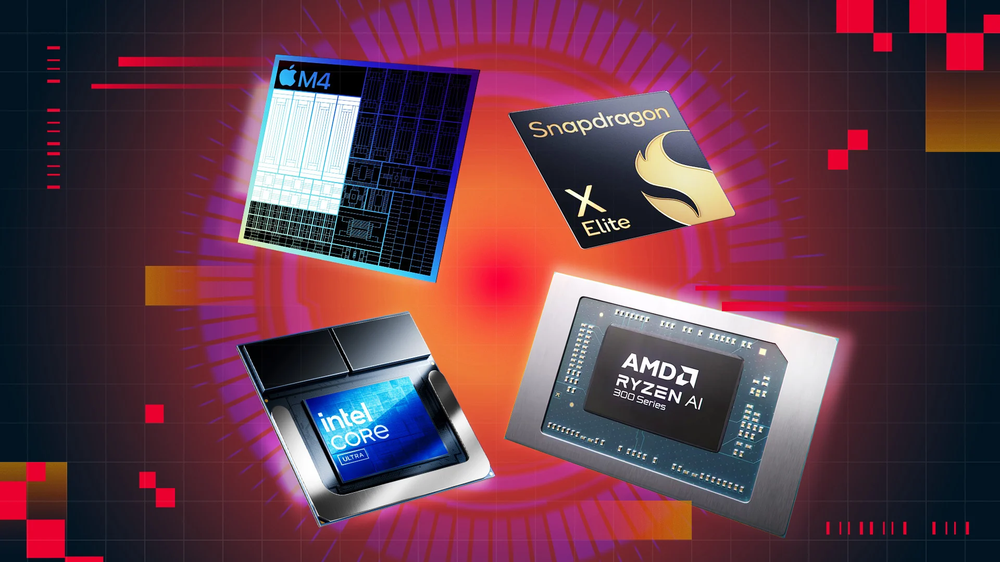

# 🚀 Week 2:  BabySOC fundamentals & functional Modelling

This repository provides comprehensive educational resources and practical implementations for understanding System-on-Chip (SoC) design principles. later, we will understand Basics of SOC practically through the VSD BabySOC chip.

--

	

# System-on-Chip (SoC) Architecture: Comprehensive Guide with Practical Examples

## Table of Contents
1. [What is a System-on-Chip (SoC)?](#what-is-a-system-on-chip-soc)
2. [Components of a Typical SoC](#components-of-a-typical-soc)
3. [Practical SoC Examples from Major Companies](#practical-soc-examples-from-major-companies)
4. [SoC Design Challenges](#soc-design-challenges)
5. [Future Trends in SoC Technology](#future-trends-in-soc-technology)

---

## What is a System-on-Chip (SoC)?

A **System-on-Chip (SoC)** is an integrated circuit that consolidates all essential components of a computer or electronic system onto a single semiconductor substrate. Unlike traditional systems that use multiple discrete chips connected via a motherboard, an SoC combines the central processing unit, memory controllers, input/output ports, and specialized processing units into one unified package.

### Key Characteristics of SoCs

**Monolithic Integration**: The fundamental principle behind SoC design is the ability to fabricate diverse functional blocks using the same manufacturing process on a single silicon die. This approach revolutionizes system design by eliminating the need for external interconnections between major system components[1][19].

**Performance Benefits**: SoCs deliver significant improvements in:
- **Performance**: Reduced signal propagation delays due to shorter interconnects
- **Power Efficiency**: Lower power consumption through optimized power domains
- **Form Factor**: Dramatic reduction in system size and weight
- **Cost Effectiveness**: Reduced manufacturing and assembly costs

**Application Domains**: Modern SoCs power virtually every electronic device:
- **Mobile Devices**: Smartphones, tablets, and wearables
- **Automotive Systems**: Infotainment, ADAS, and autonomous driving
- **IoT Devices**: Smart sensors, home automation, and industrial systems
- **Computing Platforms**: Laptops, embedded systems, and servers

### Types of SOCs
1. **Microcontroller-based SoC**:
 These SoCs are built around a microcontroller, designed for simple control tasks in everyday devices. Known for their low power usage and efficiency, they’re perfect for applications like home appliances, car systems, and IoT devices, where processing needs are minimal, and power savings are essential.

2. **Microprocessor-based SoC**: 
This type features a microprocessor, which can handle more demanding tasks and run operating systems. Commonly used in smartphones and tablets, microprocessor-based SoCs manage multiple tasks and support complex applications, providing the higher processing power necessary for interactive and data-intensive applications.

3. **Application-Specific SoC**:
 Custom-designed for specific, high-performance tasks, these SoCs excel in areas like graphics processing, network management, and multimedia applications. Optimized for speed and efficiency in their designated roles, they’re often used in graphics cards, AI hardware, and specialized industrial or financial systems that require precise, fast processing.
---

## Components of a Typical SoC

## 🟧 Central Processing Unit (CPU)
<h3 style="color:#e67e22;">Central Processing Unit (CPU)</h3>

The **CPU** serves as the primary computational engine within an SoC, executing instructions and coordinating system operations. Modern SoC CPUs employ sophisticated architectures optimized for specific applications:

#### CPU Architecture Types

**RISC-based Processors**: Reduced Instruction Set Computer architectures like ARM Cortex series and RISC-V implementations prioritize energy efficiency and simplified instruction execution.
 These processors typically feature:
- Fixed instruction length for simplified decoding
- Load/store architecture separating memory access from computation
- Large register files reducing memory access frequency
- Optimized pipeline structures for high throughput

**Multi-core Configurations**: Advanced SoCs incorporate multiple CPU cores to enable parallel processing:
- **Homogeneous Multi-core**: Multiple identical cores sharing resources
- **Heterogeneous Multi-core**: Different core types optimized for specific workloads (big.LITTLE architecture)
- **Cluster-based Designs**: CPU cores grouped in clusters with shared cache hierarchies

**Specialized Processing Units**: Beyond traditional CPUs, modern SoCs include:
- **Digital Signal Processors (DSPs)**: Optimized for mathematical operations on digital signals
- **Graphics Processing Units (GPUs)**: Parallel processing engines for graphics rendering and general-purpose computation
- **Neural Processing Units (NPUs)**: Dedicated accelerators for machine learning workloads.

### Memory Subsystem

The **memory subsystem** in an SoC encompasses multiple types of storage and memory management components:

#### On-Chip Memory Components

**Cache Hierarchy**: Multi-level cache systems (L1, L2, L3) providing high-speed access to frequently used data. Modern SoCs implement sophisticated cache hierarchies:
- **L1 Cache**: Separate instruction and data caches per core (32-128 KB)
- **L2 Cache**: Unified cache per core or shared between core clusters (256KB-4MB)
- **L3 Cache**: System-level cache shared across all cores (4-64 MB)

**Specialized Memory Types**:
- **Tightly-Coupled Memory (TCM)**: Low-latency memory directly accessible by the processor
- **Scratch Pad Memory**: Software-controlled memory for deterministic access patterns
- **Embedded SRAM**: High-speed static memory for buffering and temporary storage

#### External Memory Interfaces

**DRAM Controllers**: Interface with external dynamic memory (DDR4/DDR5/LPDDR5):
- Support for multiple memory channels (2x, 4x, 8x)
- Advanced features like Quality of Service (QoS) and Error Correction Code (ECC)
- Memory bandwidth optimization through interleaving and banking

**Advanced Memory Features**:
- **Unified Memory Architecture (UMA)**: Shared memory pool accessible by all processing units
- **Memory Management Units (MMU)**: Virtual memory support and memory protection
- **Coherency Management**: Hardware mechanisms ensuring data consistency across multiple cores

### Peripherals and I/O Interfaces

Modern SoCs integrate numerous peripheral controllers and communication interfaces to enable connectivity with external devices:

+ #### High-Speed Communication Interfaces

**Serial Communication**:
- **USB Controllers**: USB 2.0, 3.0, 3.1, and USB4/Thunderbolt support
- **PCIe Controllers**: High-speed expansion bus for external devices
- **SATA Controllers**: Storage device connectivity
- **Ethernet Controllers**: Network connectivity

**Wireless Communication**:
- **Wi-Fi Controllers**: IEEE 802.11a/b/g/n/ac/ax (Wi-Fi 6/7) support
- **Bluetooth Controllers**: Low-energy and high-speed variants
- **Cellular Modems**: 4G LTE and 5G NR support with global band coverage
- **GPS/GNSS**: Multi-constellation satellite navigation support

+ #### Display and Multimedia Interfaces

**Video Output**:
- **HDMI Controllers**: Support for 4K/8K video output
- **DisplayPort Controllers**: High-resolution display connectivity
- **MIPI-DSI**: Mobile display interface for smartphones and tablets

**Camera Interfaces**:
- **MIPI-CSI**: Camera sensor connectivity
- **Image Signal Processors (ISP)**: Real-time image processing and enhancement

+ #### General-Purpose I/O

**Configurable Interfaces**:
- **GPIO Controllers**: Programmable digital input/output pins
- **PWM Generators**: Pulse-width modulation for motor control and analog output
- **Timer/Counter Modules**: Hardware timers for real-time operations

**Analog Interfaces**:
- **ADC/DAC**: Analog-to-digital and digital-to-analog converters
- **Audio Codecs**: High-quality audio input/output processing
- **Sensor Interfaces**: Accelerometer, gyroscope, magnetometer connectivity

### Interconnect Architecture

The **interconnect system** provides the communication backbone linking all SoC components:

+ #### Bus Architectures

**AMBA Protocol Family**: ARM's Advanced Microcontroller Bus Architecture includes:
- **AXI4 (Advanced eXtensible Interface)**: High-performance, high-frequency interconnect supporting out-of-order transactions
- **AHB (Advanced High-performance Bus)**: High-speed bus for connecting high-bandwidth peripherals
- **APB (Advanced Peripheral Bus)**: Low-power bus for slower peripheral devices

**Network-on-Chip (NoC)**: Modern high-performance SoCs employ NoC architectures that treat on-chip communication as a network:
- **Packet-based Communication**: Data transmitted as packets with routing headers
- **Scalable Topology**: Mesh, torus, or custom topologies supporting many connected nodes
- **Quality of Service**: Bandwidth guarantees and latency bounds for different traffic classes
- **Congestion Management**: Flow control and traffic shaping mechanisms

+ #### Clock and Reset Distribution

**Clock Domain Management**:
- Multiple synchronized clock domains with proper crossing techniques
- Clock gating for power optimization
- Phase-Locked Loops (PLLs) for stable clock generation

**Reset Synchronization**:
- Proper reset sequencing across different functional blocks
- Power domain control for independent power management

---

## Practical SoC Examples from Major Companies

	

### Qualcomm Snapdragon 8 Gen 3: Mobile AI Powerhouse

Qualcomm's flagship mobile platform showcases advanced heterogeneous computing with on-device AI capabilities:

#### CPU Architecture

**Core Configuration**:
- **1x Cortex-X4 Prime Core**: Up to 3.3 GHz for peak performance
- **5x Cortex-A720 Performance Cores**: Multi-threaded workload optimization
- **2x Cortex-A520 Efficiency Cores**: Background task processing

**AI and Machine Learning**
- **Hexagon NPU**: 98% performance improvement over predecessor
- **Support for Large Language Models (LLMs)**: On-device generative AI
- **Multimodal AI**: Language, vision, and speech processing
- **INT4 precision support** for efficient AI inference

### NVIDIA Tegra: GPU-Centric Computing

NVIDIA's Tegra series demonstrates the integration of high-performance GPU architecture in mobile SoCs:

#### Tegra X1 Architecture

**Processing Units**:
- **4x ARM Cortex-A57 + 4x Cortex-A53**: Big.LITTLE configuration
- **256 CUDA core Maxwell GPU**: Console-quality graphics performance
- **Dual Image Signal Processors**: Advanced camera processing

**Advanced Capabilities**:
- **4K video encoding/decoding**: H.264, H.265, VP9 support
- **CUDA 6.0 and OpenGL 4.5**: General-purpose GPU computing
- **20nm manufacturing process**: Balance of performance and efficiency

---

## SoC Design Challenges

**Key SoC Design Challenges (Summary):**

- Integrating diverse IP blocks from multiple vendors increases Cost of Licensing
- Ensuring protocol compliance and timing closure
- Managing multiple power and clock domains
- Handling thermal hotspots and efficient cooling
- Reducing dynamic and static power consumption
- Addressing leakage in advanced process nodes
- Coping with high manufacturing costs and low yields
- Navigating complex design rules and verification
- Managing IP licensing, integration, and long-term support
- Advanced nodes (5nm, 3nm) offer better performance and efficiency but at higher costs.

### Future Trends in SoC Technology (Summary)

- **Advanced Process Technologies:**
	- GAA transistors for better control
	- Compound semiconductors (GaN, SiC)
	- 3D integration (vertical stacking)
- **Specialized Computing:**
	- AI/ML and cryptographic accelerators
	- Chiplet-based modular SoCs
- **Memory Innovations:**
	- Near-memory and processing-in-memory
	- Persistent/3D/neuromorphic memory
- **Connectivity & Security:**
	- Wi-Fi 7, 5G/6G, satellite comms
	- Hardware root of trust, confidential computing, post-quantum crypto
---

**📂 Repository:** [RISCV_TAPEOUT_VSD_PROGRAM](https://github.com/Agarwalprerna/RISCV_TAPEOUT_VSD_PROGRAM/tree/main)  
**👨‍💻 Author:** [Prerna]  
**📚 Program:** VLSI System Design (VSD)

---
